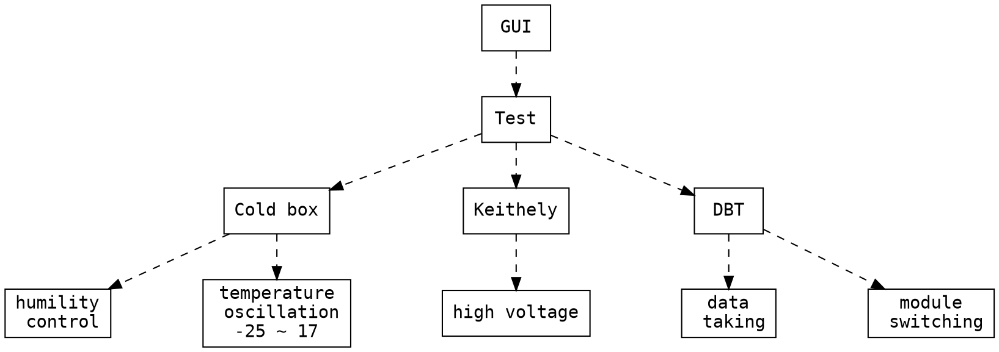

# [Design] DAQ control interface

###### `python` `GUI` ` tkinter` `pyRoot`

Same article: https://hackmd.io/s/BySpvdN4G

## Introduction
I was involved in ***Phase 1 silicon pixel detector upgrade*** of the CMS collaboration at CERN since 2014 to 2016. We successfully produced 176 silicon modules for the half of 3rd layer of barrel tracker of new phase CMS detector which has been installed in February 2017. My responsibility is to qualify each ensembled module with the **thermal stress expriement** and give the grade to central database. Thus, I am the leader of 4 to build the thermal qualificaton laboratory.


Since this is an international project, all the softwares and hardwares for the data-taking and expriements are required to be the same and stable in each center (5 in Europe and 1 in U.S.). We distribute the detail works. The data acquisition system (DAQ) software for thermal qualificaton is designed by different center and ensembled by several sorfwares depending on the hardwares. This makes the work complicate and easy to get mistake. Thus, I take this chance build a **graphic user interface (GUI)** with *python* based package *TkInter*, which is not just simplify the collaboration work but improve my programing skill.

<div style="text-align: center;" markdown="1"></div>
<br>

The major hardwares contains ***cold box***, ***Keithely*** and ***digital test board (DBT)*** which used for cooling the module, supplying high voltage and taking data, respectively. Depending on the test, the setting for the hardware are different. The GUI helps to prepare the parameters in the preprocess of the test. The concept is as the following flow chat:



The GUI ensembles the parameters and limits the ranges of them which makes the changes of test being easier and less mistakes. 

## Result
The GUI was used for 2 years production and well maintained by my team members. It has been updated for the different requirement and extened to be much fixible for parameter setting. It was also added several fool-proofing functions during the expriements. In the end, it helped our laboratory to have the best efficiency for the qualification work.  

<div style="text-align: center;" markdown="1"></div>


## References
- Github: https://github.com/juifa-tsai/elComandanteGUI 
- TkInter wiki: https://wiki.python.org/moin/TkInter

## Usage
1. Install under elcomandante
2. Set your parameters as the examples in `config/`
3. Run the ./guiElcomandante.py
```bash
./guiElcomandante.py
```
